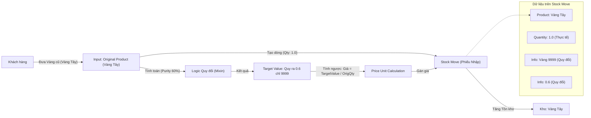

## 2. Các Module Tùy chỉnh (Custom Addons)

## 2. Các Module Tùy chỉnh (Custom Addons)

Dự án hiện tại đã hợp nhất các tính năng vào một module lõi duy nhất là **`qlv`** (Quản lý Vàng).

### Module `qlv`
*   **Mục đích**: Quản lý toàn diện nghiệp vụ cửa hàng vàng (Giá, Mua/Bán, Trade-in, Cầm cố).
*   **Các thành phần chính:**

#### a. Quản lý Giá & Sản phẩm (`product_price_manager` cũ)
*   Sử dụng `list_price` (Bán) và `standard_price` (Mua/Vốn).
*   Lưu lịch sử thay đổi giá (`product.price.history`).

#### b. Nghiệp vụ Mua Bán & Trade-in (`sale.order` extension)
*   **Cân bằng tiền (Auto-Balance):**
    *   Sử dụng **Sản phẩm Tiền mặt** (Money Product) để đại diện cho tiền.
    *   Logic tự động thêm dòng Tiền mặt để đưa `amount_total` về 0 (Tiền Hàng = Tiền Khách Trả).
    *   Hỗ trợ trigger cập nhật lại tiền khi sửa đơn hàng (đặc biệt sau khi Thanh lý).
*   **Trade-in:**
    *   Dòng hàng có `is_trade_in=True` sẽ được xử lý là Hàng Mua (Receipt) thay vì Hàng Bán.
    *   Giá âm để giảm trừ tổng thanh toán.
*   **Tích hợp Cầm cố:**
    *   Hiển thị danh sách `pending_pawn_ids` (Cầm cố đang hiệu lực) ngay trên form bán hàng.
*   **Quản lý Trạng thái & UI Fix:**
    *   Field `custom_state`: Ánh xạ lại trạng thái gốc (draft, sale, done) sang ngôn ngữ nghiệp vụ (Đang lập phiếu, Hợp đồng...).
    *   **Locking:** Override hàm `write()` để chặn sửa đổi khi đơn ở trạng thái `done` hoặc `invoiced`.
    *   **JS Patch (`force_sort_patch.js`):** Can thiệp vào `ListRenderer`.
        *   Tự động phát hiện khi User "Thêm hàng".
        *   Chặn hành vi nhảy Focus khi danh sách được sắp xếp lại.
        *   Cơ chế **Polling** tìm lại dòng vừa nhập để restore focus (cursor).

#### c. Nghiệp vụ Cầm cố (`pawn.order` - NEW)
*   **Model:** `pawn.order` và `pawn.order.line`.
*   **Workflow:**
    *   **Confirm:** Tạo phiếu nhập kho Tài sản + Phiếu xuất kho Tiền.
    *   **Redeem:** Tạo phiếu thu Tiền + Phiếu trả Tài sản.
    *   **Liquidate:** 
        *   Tạo phiếu trả hàng ảo (Clear Stock Owner).
        *   Tạo `sale.order` mới với các line là Trade-in.
        *   Link `pawn.order` -> `sale.order`.
*   **Trạng thái & Quyền hạn:**
    *   Sử dụng `readonly` attributes ở View layer để khóa dữ liệu khi phiếu đã tất toán (chỉ mở `note`).

### 6. Logic Tính Công Nợ (Debt Calculation)
**Mô hình:** Tiền là Hàng hóa (`product.product`).
**Nguyên tắc:** 
- Công nợ được tính dựa trên **Tổng giá trị các phiếu kho (Stock Moves)** đã hoàn thành (`state='done'`).
- **Phải thu (Debt Increases):** Giá trị hàng/tiền Shop chuyển cho Khách (Outgoing).
- **Phải trả (Debt Decreases):** Giá trị hàng/tiền Khách chuyển cho Shop (Incoming).

**Công thức:**
```python
Net Debt = Sum(Qty * Price) [Outgoing to Customer] - Sum(Qty * Price) [Incoming from Customer]
```

**Bộ lọc quan trọng:**
1.  **Loại trừ Hàng gửi (Collateral):** Các phiếu kho có `picking_id.owner_id` được set (Hàng của khách gửi kho) **KHÔNG** tính vào công nợ.
    - Ví dụ: Khách cầm vàng (Pawn) -> Kho nhận vàng (Owner=Khách) -> Không thay đổi công nợ.
    - Shop đưa tiền (Loan) -> Kho xuất tiền (Owner=Shop) -> Tăng nợ.
2.  **Giá trị (Price):** Ưu tiên sử dụng `price_unit_base` (nếu có logic trade-in) hoặc `price_unit` gốc của stock move.

## 4. Quy trình Thiết lập Đơn hàng (Process Flow)

Biểu đồ dưới đây mô tả chi tiết luồng dữ liệu và logic khi thiết lập một đơn hàng trong hệ thống `qlv` (Dựa trên Implementation Plan V4 & Code Review).

```mermaid
graph TD
    %% Nodes
    Start(["User: Tạo Đơn hàng Mới"]) --> SelectPartner["Chọn Khách Hàng"]
    SelectPartner --> DependPartner{"Logic: Partner Info"}
    DependPartner -- Trigger --> LoadPending["Hiện: Đơn cũ chưa xong & Đơn Cầm cố active"]
    
    %% Split Buttons
    LoadPending --> UserAction{"User Action"}
    UserAction -- "Click Thêm hàng bán" --> AddSell["Thêm Line Bán"]
    UserAction -- "Click Thêm hàng mua" --> AddBuy["Thêm Line Mua/Trade-in"]
    
    %% Defaults (Context)
    AddSell --> ContextSell["Ctx: default_sequence=10, is_trade_in=False"]
    AddBuy --> ContextBuy["Ctx: default_sequence=110, is_trade_in=True"]
    
    %% Line Logic
    ContextSell --> SelectProduct["User: Chọn Sản phẩm"]
    ContextBuy --> SelectProduct
    
    SelectProduct --> OnchangeProduct{"Onchange: Product Info"}
    OnchangeProduct -- Logic --> Defaults["Gán: UoM, Std Purity, Price"]
    
    %% Default -> Conversion Logic
    Defaults --> Conversion{"Conversion Mixin Logic"}
    Conversion -- "Input: Original Prod, Weight, LOSS" --> MixinCalc["Net Weight = Orig Weight - Loss"]
    MixinCalc -- "Input: Gold Purity" --> ConvertedQty["Converted Qty = Net Weight * Purity (Quy về 4 số)"]
    
    %% Price Calc
    ConvertedQty --> Computation{"Master Calculation"}
    Computation -- Inputs --> CalcData["Converted Qty, Exchange Rate, Compensation"]
    CalcData --> ModeParams{"Mode?"}
    
    ModeParams -- "Stock/Gold Mode" --> CalcStock["Qty = Converted Qty <br/> Price = Base * Rate / Qty"]
    ModeParams -- "Money Mode" --> CalcMoney["Qty = 1 <br/> Price = Converted Qty * Rate"]
    
    CalcStock --> SignLogic
    CalcMoney --> SignLogic
    
    SignLogic{"Sign Logic"}
    SignLogic -- Sell --> SignPos["Price > 0 (Revenue)"]
    SignLogic -- Trade-in --> SignNeg["Price < 0 (Expense)"]
    
    %% Parent Logic
    SignPos --> TriggerParent["Trigger: _onchange_balance_money"]
    SignNeg --> TriggerParent
    
    %% Auto Balance & Sort
    TriggerParent --> AutoSort{"Auto Sort & maintain Focus"}
    AutoSort -- "JS Patch" --> FixFocus["Giữ Focus tại dòng đang nhập"]
    AutoSort -- Python --> GroupLines["Phân nhóm: Sell(0-99), Buy(100+), Money(9999)"]
    
    GroupLines --> CalcBalance["Tính tổng: Goods + Trade-in + Manual Money"]
    CalcBalance --> CheckBal{"Balance Needed?"}
    
    CheckBal -- Yes --> UpdateMoney["Tạo/Update dòng Tiền Tự động"]
    CheckBal -- No --> RemoveMoney["Xóa dòng Tiền thừa"]
    
    UpdateMoney --> DisplaySign{"Tiền Âm/Dương?"}
    DisplaySign -- "Âm (Shop Thu)" --> LabelThu["Label: Thu tiền mặt"]
    DisplaySign -- "Dương (Shop Trả)" --> LabelChi["Label: Chi tiền mặt"]
    
    %% Final State
    LabelThu --> Save["Lưu Đơn hàng"]
    LabelChi --> Save
    RemoveMoney --> Save
    
    Save --> ComputeState{"Custom State Compute"}
    ComputeState -- Draft --> LabelDraft["Đang lập phiếu"]
    
    %% Locking
    LabelDraft --> Confirm["Confirm Order"]
    Confirm --> ProcessIO["Xử lý Kho/Invoice"]
    ProcessIO -- Done --> StateDone["Đã giao dịch"]
    StateDone --> Lock{"Write Override"}
    Lock -- "Edit Attempt" --> Block["Error: Locked"]
    Lock -- "Super Cancel" --> Revert["Auto Return + Cancel Invoice"]
```



## 5. Quy trình Luân chuyển Hàng hóa (Inventory Flow)

Cơ chế phân tách phiếu kho tự động khi xác nhận đơn hàng (`action_confirm`).

```mermaid
graph TD
    %% Initial State
    SO(["Sale Order (Confirmed)"]) -- "1. Standard Odoo Flow" --> InitialPick["Initial Delivery Order (All Lines)"]
    
    %% Split Logic
    InitialPick -- "2. Scan Lines" --> ScanLines{"Check: is_trade_in?"}
    
    ScanLines -- "False (Hàng Bán)" --> KeepDeliv["Giữ lại ở Delivery Order"]
    ScanLines -- "True (Hàng Mua/Trade-in)" --> MoveToReceipt["Chuyển sang Receipt (Phiếu Nhập)"]
    
    %% Money Logic Integration
    subgraph MoneyFlow [Luồng Tiền mặt (Nếu quản lý kho)]
        MoneyIn["Thu tiền (Auto-Balance)"] -- "is_trade_in=True" --> MoveToReceipt
        MoneyOut["Chi tiền (Auto-Balance)"] -- "is_trade_in=False" --> KeepDeliv
    end
    
    %% Final Result
    KeepDeliv --> FinalDeliv["Phiếu Xuất (Delivery Order)"]
    MoveToReceipt --> FinalReceipt["Phiếu Nhập (Receipt)"]
    
    %% Locations
    FinalDeliv -- "Xuất từ" --> StockLoc["Kho Hàng hóa"]
    FinalDeliv -- "Đến" --> PartLoc["Địa điểm Khách hàng"]
    
    PartLoc -- "Xuất từ" --> FinalReceipt
    FinalReceipt -- "Nhập về" --> StockLoc
    
    %% Validation
    FinalDeliv -- Validate --> StockOut["Ghi nhận: Giảm tồn kho"]
    FinalReceipt -- Validate --> StockIn["Ghi nhận: Tăng tồn kho"]
```

### 5.1. Cơ chế Quy đổi trong Kho (Stock Conversion Detail)

Với các đơn hàng có Quy đổi (Ví dụ: Khách bán vàng tây, quy về vàng 9999), hệ thống sẽ **ghi nhận nhập kho theo Sản phẩm Đích** (Target Product) nhưng vẫn lưu trữ thông tin gốc.



## 6. Cấu trúc Thư mục


```
e:\repo\odoo_docker\
├── docker-compose.yml          # File cấu hình Docker
├── custom_addons\              # Thư mục chứa module tùy chỉnh
│   ├── qlv\                    # Module Quản lý Vàng (Core)
│   └── configure_gold_shop.py  # Script cấu hình ban đầu
├── docs\                       # Tài liệu dự án
└── README.md                   # Hướng dẫn chính
```
